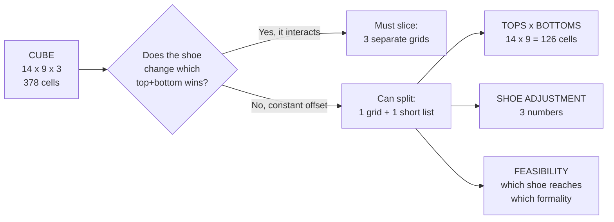

# Wardrobe matrices

Generated by `styling/matrix.py`. Scores from the rubric in `styling/scoring-method.md`.

## Why one 2D matrix is enough

An outfit is three choices, so the full picture is a **cube**: 14 tops x 9 bottoms x 3 shoes = 378 cells. You cannot draw a cube on a page. The usual options are:

| Option | What it looks like | Cost |
|---|---|---|
| **Slice it** | 3 separate 14x9 grids, one per shoe | Nothing lost, but 3 grids to compare by eye |
| **Collapse it** | 1 grid of 14x9, each cell = best shoe | Hides the shoe choice |
| **Split it** | tops x bottoms grid + a separate bottoms x shoes grid | Only works if the shoe does not interact |

Which one is right is not a matter of taste — it depends on whether the shoe **interacts** with the top and bottom, or just shifts everything by a constant. That is measurable, so I measured it.

**Measured result:** swapping the shoe moves every cell by almost exactly the same amount, and the cork sandals win in **126 of 126** cells:

| Shoe | Effect on score | Varies by |
|---|---|---|
| Cork Sandals (light olive) | +0.0 | only 0.0 pts across all 126 cells |
| Onitsuka Mexico 66 | -10.5 | only 2.6 pts across all 126 cells |
| Adidas Sambas | -12.4 | only 3.9 pts across all 126 cells |

A shift that constant is not a real third dimension. The shoe **does not change which outfit is better** — it changes how good all of them are, by the same amount. So: one 2D grid, plus three numbers.

The shoe only genuinely matters in one place, and it is not the score — it is **reach**. See the feasibility grid at the bottom.

## Matrix 1 — tops x bottoms

Score assumes **cork sandals**. For the other two, subtract ~9 (Onitsuka) or ~10 (Sambas). `--` means the pairing is incoherent at any formality. Bold = 84+.

| Top \ Bottom | Lounge | Blk Shrt | Bge Shrt | Denim | Nvy Shrt | Camel | Bge Linen | Dk Brown | Pleated | best |
|---|---|---|---|---|---|---|---|---|---|---|
| Rustic Button-down | 76 | 80 | **86** | 73 | **86** | 74 | **88** | 81 | -- | 88 |
| Wine Polo | 76 | 80 | **86** | 74 | **86** | 82 | **87** | 74 | -- | 87 |
| Striped Camp Collar Shirt | 72 | 76 | **85** | 72 | 80 | 80 | 82 | 78 | -- | 85 |
| White LS Shirt / black stripes | 69 | 73 | 82 | 69 | 76 | 77 | 79 | 75 | -- | 82 |
| Rust Crew-neck | 68 | 72 | 78 | 65 | 78 | 66 | 80 | 73 | -- | 80 |
| Navy LS Shirt / white stripes | 68 | 72 | 79 | 66 | 75 | 77 | 80 | 77 | -- | 80 |
| Navy Linen Shirt (Hamptons) | 64 | 67 | 76 | 63 | 70 | 77 | 77 | 77 | -- | 77 |
| Wine Crew-neck | 66 | 70 | 76 | 64 | 76 | 72 | 76 | 64 | -- | 76 |
| Navy Striped Shirt (SS) | 63 | 67 | 74 | 61 | 73 | 72 | 76 | 72 | -- | 76 |
| Navy Oversized Shirt | 62 | 66 | 75 | 62 | 70 | 76 | 76 | 76 | -- | 76 |
| Forest Corduroy Shirt | 63 | 67 | 72 | 55 | 74 | 69 | 74 | 61 | -- | 74 |
| White Crew-neck | 55 | 59 | 70 | 58 | 65 | 66 | 64 | 60 | -- | 70 |
| Black Crew-neck | 48 | 52 | 60 | 48 | 58 | 61 | 62 | 61 | -- | 62 |
| White Formal Shirt | -- | -- | -- | -- | -- | -- | -- | -- | -- | 0 |

| best | 76 | 80 | 86 | 74 | 86 | 82 | 88 | 81 | 0 | |

### The two empty lines mean opposite things

The Pleated **column** and the White Formal **row** are both all `--`, but for completely different reasons, and it would be easy to draw the wrong conclusion:

- **White Formal row — genuinely dead.** Its formality floor is 0.55. No bottom *and no shoe* you own reaches that. It is empty in all three slices of the cube. Leave it home.
- **Pleated column — an artifact of this slice only.** The pants are fine; they just cannot be worn with the sandals this grid assumes (sandals cap at 0.40, pleats start at 0.45). Swap to a sneaker and the column fills in completely:

| Black Pleated + Onitsuka | Score |
|---|---|
| Wine Polo | 67 |
| Rustic Button-down | 66 |
| Striped Camp Collar Shirt | 62 |
| White LS Shirt / black stripes | 59 |
| Rust Crew-neck | 58 |
| ...7 more | |
| Black Crew-neck | 38 |

This is the general trap with a collapsed matrix: **an empty cell can mean "impossible" or it can mean "you are looking at the wrong slice."** Matrix 2 below is what tells you which.

## Matrix 2 — bottoms x shoes (reach, not quality)

This is the only place the shoe earns its own grid. A tick means the pairing is formality-coherent; the range is how far up it can go.

| Bottom | Cork Sandals | Onitsuka Mexico 66 | Adidas Sambas |
|---|---|---|---|
| Black Lounge Pants | 0.18–0.38 | 0.25–0.38 | 0.25–0.38 |
| Black Shorts | 0.18–0.38 | 0.25–0.38 | 0.25–0.38 |
| Beige Shorts | 0.20–0.40 | 0.25–0.42 | 0.25–0.42 |
| Light-blue Denim | 0.22–0.40 | 0.25–0.45 | 0.25–0.45 |
| Navy Linen Shorts | 0.25–0.40 | 0.25–0.46 | 0.25–0.48 |
| Camel Chinos | 0.38–0.40 | 0.38–0.46 | 0.38–0.48 |
| Beige Linen Pants | 0.40–0.40 | 0.40–0.46 | 0.40–0.48 |
| Dark Brown Chinos | 0.40–0.40 | 0.40–0.46 | 0.40–0.48 |
| Black Pleated Wide Pants | x | 0.45–0.46 | 0.45–0.48 |

Read the right-hand columns: the sneakers are the only way to reach above **0.40**. That is the entire argument for packing them — not that they look better, they do not, but that the sandals cannot go there.

## How to read Matrix 1

- **A row that is mostly low** = a top that is hard to use. Look at Black Crew-neck and Forest Corduroy.
- **A column that is mostly high** = a bottom worth packing. Beige Linen Pants and Beige Shorts carry the wardrobe.
- **`--` in a cell** = not a taste judgement, a hard incoherence: the two pieces have no formality level at which they both work.
- **The `best` column** is the ceiling for that top. A top whose best is under 70 is not worth the suitcase space.

