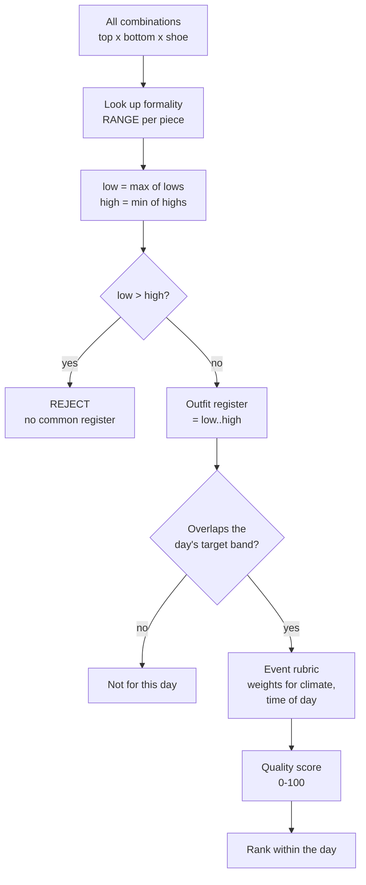
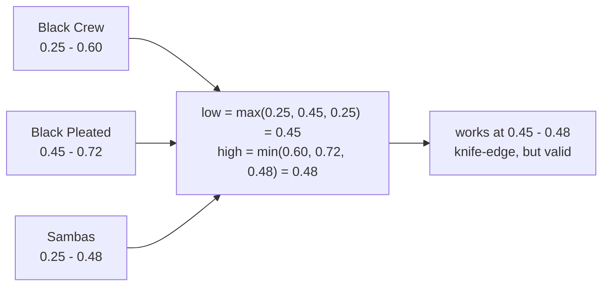
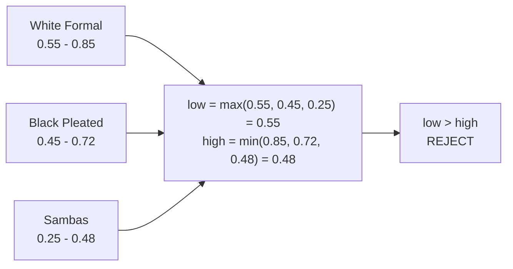
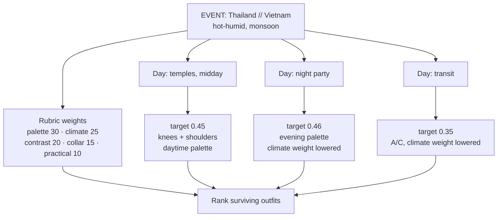

# How an outfit is scored

Two different things are happening, and they are not the same kind of number.

| | What it is | How it's produced |
|---|---|---|
| **Formality range & overlap** | Interval arithmetic on per-piece ranges | Objective. You can verify it. |
| **Occasion & coherence gates** | Threshold rules | Objective, once thresholds are agreed. |
| **Quality score (0–100)** | How well it suits *you* | **Judgement**, structured by the rubric below. |

The per-piece ranges are judgement calls — but once assigned, everything
downstream is arithmetic.

---

## Correction: formality is a range, not a point

The first version of this document scored each piece with a single formality
number and rejected an outfit when the **spread** (max − min) exceeded 0.30.

That rule was wrong. It rejected this:

```
Black Crew 0.30  +  Black Pleated 0.62  +  Sambas 0.30   ->  spread 0.32  ->  REJECT
```

which is a deliberate, well-established look — dressing up a crew neck, or
dressing down tailored trousers. Any model that throws it out is broken.

**What the spread rule missed:** a garment doesn't occupy one point on the
formality scale. It occupies a *range*. A black crew neck is credible anywhere
from a beach bar to under a blazer. A white poplin dress shirt is credible
across a much narrower, higher band — it cannot come down to meet sneakers.

So the real question is not "how far apart are these pieces?" but:

> **Is there a single register that every piece in this outfit can credibly occupy?**

That is an interval intersection.

```
outfit_low  = max(piece_low  for every piece)
outfit_high = min(piece_high for every piece)

if outfit_low > outfit_high  ->  no common register  ->  REJECT
else                         ->  outfit works at [outfit_low, outfit_high]
```

The width of that surviving interval is itself informative:

| Interval width | Meaning |
|---|---|
| ≥ 0.20 | Versatile — works across several settings |
| 0.05 – 0.20 | Precise — works, but at one register |
| ≤ 0.05 | Knife-edge — works only if executed carefully |
| empty | Reject — no register satisfies every piece |

---

## The pipeline



Coherence is a **gate**, not a score — an outfit with no common register never
reaches the rubric.

---

## Step 1 — per-piece formality ranges

```
      0.1   0.2   0.3   0.4   0.5   0.6   0.7   0.8   0.9
       |     |     |     |     |     |     |     |     |
TOPS
  Black Crew           [=========================]              0.25-0.60
  White Crew           [=========================]              0.25-0.60
  Rust Crew            [====================]                   0.25-0.55
  Wine Crew              [======================]               0.28-0.60
  Wine Polo                 [==================]                0.32-0.62  NEW
  Navy Hamptons            [==============]                     0.32-0.50
  Striped Camp              [================]                  0.33-0.58
  Rustic Button-down          [=============]                   0.35-0.55
  Navy 1/2-sleeve             [=============]                   0.35-0.55
  Navy Oversized              [=============]                   0.35-0.55
  Forest Corduroy              [=============]                  0.38-0.58
  White/black stripe LS        [================]               0.38-0.62  NEW
  Navy/white stripe LS         [================]               0.38-0.62  NEW
  White Formal                          [=================]     0.55-0.85

BOTTOMS
  Black Lounge      [=============]                             0.12-0.38
  Black Shorts        [==========]                              0.18-0.38  NEW
  Beige Shorts         [===========]                            0.20-0.42  NEW
  Light-blue Denim      [===========]                           0.22-0.45
  Navy Linen Shorts      [============]                         0.25-0.48  NEW
  Camel Chinos                 [============]                   0.38-0.62
  Beige Linen                   [===========]                   0.40-0.62
  Dark Brown Chinos             [============]                  0.40-0.65
  Black Pleated                    [=============]              0.45-0.72

SHOES
  Cork Sandals (olive)  [=========]                             0.18-0.40  NEW
  Onitsuka 66           [==========]                            0.25-0.46
  Adidas Sambas         [===========]                           0.25-0.48
  (dress shoe)                        [==============]          0.50-0.80
```

Read this as capability, not preference. Wide range = wardrobe workhorse. The
crew necks are the most versatile things you own. The white formal shirt is the
least — it is stranded above everything else you packed.

**The ceiling did not move.** The sandals sit *below* both sneakers
(0.40 vs 0.48), so the highest register any outfit can reach is still capped at
**0.48** by the Adidas Sambas. The white formal shirt (floor 0.55) remains
unreachable. Sandals solve rain, not dress-up.

**Shorts are temple-disqualified.** Three of the four new bottoms fail the
knees-covered rule, so temple days still draw from the six full-length bottoms.

---

## Step 2 — worked examples

### Black Crew + Black Pleated + Sambas — the case that broke the old rule



The trousers pull the floor up to 0.45; the sneakers pull the ceiling down to
0.48. They *just* meet. That narrow window is exactly why this look is easy to
get wrong — swap in scruffier sneakers and the window closes.

### White Formal + Black Pleated + Sambas



The shirt's floor (0.55) is above the sneakers' ceiling (0.48). No register
satisfies both. The model also names the binding constraint: swap the sneakers
for a dress shoe (0.50–0.80) and it becomes **[0.55, 0.72]** — a comfortable,
valid evening outfit.

### Why both verdicts are right

The old spread rule gave 0.32 and 0.50 — same side of the same threshold, only
0.18 apart. The interval model separates them cleanly, because it asks the
question that actually matters.

---

## Step 3 — the rubric belongs to the event

Weights are not universal. A rubric tuned for Thailand in August is wrong for
Tokyo in November. So the rubric is a property of the **event**, and each day
within the event carries its own target.



### Time of day is its own axis

It moves three things at once, and they don't all move together:

| | Daytime | Evening |
|---|---|---|
| **Temperature** | 30–34 °C → climate weight **25** | 24–27 °C → climate weight **12**, denim and corduroy become viable |
| **Colour** | Light values reflect heat; cream, camel, light blue | Deep, saturated values read richer under low light; wine, forest, chocolate, black |
| **Formality** | Skews down ~0.05 | Skews up ~0.10 |

This is why your **wine crew** and **dark brown chinos** are evening pieces and
your **beige linen** is a midday piece — not a formality difference, a
time-of-day one.

---

## The quality rubric

Applied only to outfits that survive both gates.

| Criterion | Weight (this event) | What earns points |
|---|---|---|
| Autumn palette harmony | 30 | Warm browns, camel, rust, olive, cream. Black and true navy lose points near the face. |
| Climate suitability | 25 day / 12 night | Open weave, natural fibre. |
| Contrast & proportion | 20 | Medium value break; wide or straight leg; vertical lines over the midsection. |
| Collar vs round face | 15 | Camp and point collars elongate. Crew necks echo the roundness. |
| Rain & practicality | 10 | Dries fast, hides wrinkles. |
| Evening presence | 0 day / 13 night | Deep, saturated colour. Pale flat colour washes out under warm low light. |

### Second correction: a day is a target, not a band

The first implementation filtered days by **band overlap** — does the outfit's
interval overlap the day's acceptable range. This was useless: 338 of 338
coherent outfits "qualified" for every single day, because almost every interval
overlaps almost every band. The buckets were identical.

A day now names **one target formality**, and an outfit qualifies only if its
surviving interval *contains* that target. That is the same logic as the
coherence gate, applied once more with the day included. The buckets separate
properly: 60 outfits work at 0.30, 150 at 0.35, 130 at 0.45.

### Third correction: night is not a penalty

Dropping the climate weight from 25 to 12 quietly punished every evening outfit,
because climate was a criterion most outfits scored *well* on — removing weight
from a strong criterion drags the average down. The 13 points now move to
**evening presence** rather than vanishing, so the total is always out of 100
and night outfits are judged on a night criterion instead of being docked.

---

## Results

Run `python3 styling/rank.py`. Inventory lives in `styling/wardrobe.json`,
output in `styling/vietnam-2026-plan.md`.

- 14 tops × 9 bottoms × 3 shoes = **378** combinations, no layering
- **338** coherent (89%) · **40** rejected
- Of the 40 rejects: 27 involve the White Formal Shirt, 13 are cork sandals with
  the black pleated pants

The gate that was supposed to be the clever part turns out to be a weak filter.
Almost everything you own is formality-compatible with almost everything else.
The discrimination comes from the day target and the rubric.

### The challenge case, resolved

You asked whether a crew neck with black pleated pants would be wrongly rejected
at the spread filter. Under the interval model it is **accepted**:

| Outfit | Interval | Verdict | Score |
|---|---|---|---|
| Black Crew + Black Pleated + Sambas | 0.45–0.48 | coherent | **39.9** |
| Wine Crew + Black Pleated + Sambas | 0.45–0.48 | coherent | **53.3** |
| Rustic Button-down + Black Pleated + Onitsuka | 0.45–0.46 | coherent | **71.8** |
| White Formal + Black Pleated + Sambas | 0.55 > 0.48 | **rejected** | — |

The old spread rule scored the first at 0.32 and the last at 0.50 and could not
tell them apart. The interval model gets all four right.

Note what the black crew version loses on: **not formality**. It loses 
head-to-toe black, a cool colour at a warm-autumn face, and a round collar on a
round face — three separate rubric penalties. Change only the top colour and it
gains 13 points at identical formality. That is the correct diagnosis of
"dressing up a crew neck": the silhouette was never the problem.

---

## What the seven additions changed

| Piece | Verdict |
|---|---|
| **Wine polo** (cotton pique) | Best single addition. A collar and open placket give the V-shape a round face wants, without a crew's roundness. Wine is on-palette, pique breathes, and the 0.32–0.62 range is the widest of any collared top you own. |
| **Navy LS / white stripes** (linen blend) | Vertical stripes elongate the midsection; linen blend breathes; long sleeves cover shoulders for temples and block sun. Navy-and-white reads closest to your stated Old Money aesthetic. |
| **White LS / black stripes** (linen blend) | Same structural win, and its black stripe deliberately ties to your black bottoms instead of fighting them. |
| **Cork sandals, light olive** | Your only warm-toned footwear. Olive is a core Autumn neutral and cork reads warm — everything else on your feet is black, which fights the palette. Solves rain. Does **not** raise the formality ceiling. |
| **Beige cotton shorts** | Best of the three shorts: on-palette warm neutral, pairs with every top. |
| **Navy linen shorts** | Best fabric and the dressiest shorts (to 0.48), slightly cool for the palette. |
| **Black cotton shorts** | Weakest on palette, but it is a bottom, so black stays far from the face and is mitigated. Fine under the wine polo or rust crew. |

**Layering note.** The two striped shirts are a slimmer regular fit, so they work
as standalone tops rather than open overshirts. The Navy Oversized remains the
only real layering piece — which matters, because an open overshirt is the main
vertical-line trick available for the midsection.

**Combination space.** 14 tops x 9 bottoms x 3 shoes = **378** outfits, against
9 days. The question is no longer whether there is enough; it is which to pick.
Corduroy, lounge pants and the white formal shirt are now clearly droppable.

---

## Known limits

**Loungewear pairing.** Black Lounge + White Crew produces a valid interval
(0.25–0.38) but reads like pyjamas. That failure is not about formality — it is
that both pieces are jersey knit, so they read as a *set*. Needs a separate
signal: penalise when top and bottom share a casual knit construction.

**An earlier inconsistency, kept on the record.** In the flat 66-cell matrix I
scored Rust Crew + Denim at **86**. Under the explicit rubric it is **69**. The
whole gap is climate weighting — that matrix was judging "does this look good"
and barely penalising denim, while the Python pipeline weighted breathability at
2.8x and buried it. Two passes of my own judgement disagreed by 17 points
because the weights were implicit. That is the argument for writing them down.

---

## Audit log

The scores were not hand-verified when first produced. Auditing the top 15
found three real defects.

### Defect 1 — contrast was measured in the wrong colour space

`dl` used WCAG relative luminance (physically linear). Contrast is a
*perceptual* judgement, and linear luminance is wildly non-uniform:

| Pair | dY (used) | ΔL\* (true) | Old verdict | Correct |
|---|---|---|---|---|
| White shirt + Beige linen | 0.10 | 4 | good break | **tonal** |
| Rust + Navy shorts | 0.10 | 34 | good break | good break |
| Rust + Camel chinos | 0.08 | 12 | good break | **tonal** |
| Black + Camel | 0.18 | 50 | good break | good break |

The same `dY` of 0.10 described both a near-invisible difference and a strong
one — the metric was **non-monotonic with perception**, so it could not rank
what it was built to rank. Switched to CIE L\*, thresholds retuned to 12 and 62
L\* units.

Effect: the previous #1 outfit (Striped Camp Collar + Beige Linen + Sandals,
88.5) fell to #8 at 81.6, correctly — white on cream is tonal. It stays high
only because its black vertical stripes supply the missing contrast, which the
model now says explicitly: the same trousers under a *plain* White Crew score
**63.2**, an 18-point gap that is entirely the stripes.

### Defect 2 — the stripe bonus was flat

A vertical stripe was worth a fixed +0.15 whether or not the outfit needed it,
and was usually swallowed by the cap. It now scales with what the colours fail
to provide: `0.30 x (1 - contrast_score)`. A stripe rescues a tonal outfit and
adds nothing to one that already has a clean value break.

### Defect 3 — day assignment was order-dependent greedy

Days were filled in date order, so 16 Aug got first pick of the whole wardrobe
and 24 Aug got the leftovers. Across 200 random day orderings the same greedy
produced totals from 655.4 to 693.9 — a **38.5-point swing driven purely by the
order the days happened to be processed in**. Date order scored 678.9, near the
middle. That is an artifact, not a styling result.

Replaced with 300 random restarts scored **lexicographically: lift the worst day
first, then the total**. Maximising the total alone let the optimiser dump a
68.6 outfit on the arrival day to buy points elsewhere — but you still have to
wear the bad day. Final plan: worst day **70.1**, total 676.3. The total is
*lower* than the sum-maximising plan by 13.6 points, deliberately.

### What the audit did not fix

- **No hue-harmony term.** Palette membership and lightness contrast are scored;
  hue clash is not. Wine + navy ranks well because each piece is individually
  acceptable and their lightness differs. Unverified.
- **Weights remain calibrated judgement.** 30/25/20/15/10 is defensible, not
  derived. Nothing was measured to produce those numbers.
- **Top-15 audited, 323 not.** The defects were found by inspecting the top 15
  by hand. The tail is assumed correct by construction.

---

## Climate: what the model actually used, and what the data says

Prompted by a fair challenge — *do these scores account for temperature,
humidity and rainfall?* — I traced every environment input. The answer was
"less than the write-up implied."

| Factor | Was it in the model? | How |
|---|---|---|
| Temperature | **No** | No temperature variable existed. `HEAT` is a static fabric table. |
| Humidity | **No** | Absent entirely. Baked into how fabrics were *ranked*, but not a variable. |
| Precipitation | **Crudely** | One hand-set boolean on one day. |
| Effect on **formality** | **None** | Formality intervals were fixed constants. Weather could not move them. |

### Measured data (IBST via Wikipedia, August)

| City | Mean high | Mean low | Humidity | Rain | Rainy days |
|---|---|---|---|---|---|
| Hanoi | 32.6 °C | **26.1 °C** | 82.7% | 309 mm | 16.5 / 31 |
| Da Nang / Hoi An | 33.9 °C | 25.6 °C | 77.4% | 141 mm | 11.6 / 31 |
| HCMC \* | 31.6 °C | 23.9 °C | ~82% | ~270 mm | ~20 / 31 |

\* HCMC figures could not be extracted directly from the IBST table and are
unverified.

### Two model assumptions the data falsified

**1. "Evenings are cooler, so comfort matters less."** This document previously
claimed evenings drop to 24–27 °C and that *"denim and corduroy become viable."*
The measured diurnal range is only **6.5 °C**, and Hanoi's August overnight low
is **26.1 °C at 82.7% humidity**. Nights are hot. The evening climate weight was
cut from 25 to 12 on a false premise; it is now **20**, with 5 points to
presence rather than 13.

**2. "Rain is an exception."** Rain was a boolean set by hand on one of nine
days. Measured: **53% of August days in Hanoi, 65% in HCMC, 37% in Da Nang.**
Rain is the baseline condition. `rainy` is replaced by `rain_p`, a measured
probability per day, scaling the quick-dry term continuously.

### The formality question: an honest non-answer

Whether tropical norms *raise* the formality ceiling of dressy sandals could not
be established. The research found no citable venue dress code, and no menswear
or etiquette source that states the heat/formality relationship explicitly. Every
relevant finding came back **"Medium (inferred)"** or **"Low (gap)"**, and the
core inference rests on *absence* of prohibition — which is weak.

So the parameter was **not changed**. Instead, here is how much the answer
depends on it:

| Sandal ceiling | Coherent outfits | Night-out pool | Sandals wearable at night | White Formal outfits |
|---|---|---|---|---|
| **0.40** (current, Western assumption) | 338 | 130 | 0 | **0** |
| 0.50 | 351 | 195 | 65 | 0 |
| **0.55** | 355 | 195 | 65 | **4** |
| 0.60 | 355 | 195 | 65 | 4 |

The White Formal Shirt flips from dead to wearable at **exactly 0.55**, because
that is its formality floor. The research recommended raising sandals by
0.10–0.15, i.e. to 0.50–0.55 — landing precisely on the boundary. The question
"can I wear the white shirt" therefore has no defensible answer from the
evidence gathered: it sits exactly at the edge of an unresolved parameter.
